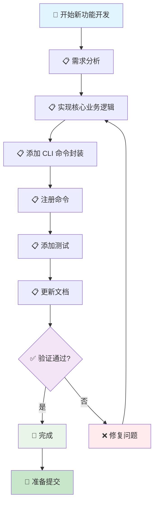

# 新功能开发流程

> 🤖 **AI 工作流文档**：本文档是专为 AI 助手设计的新功能开发工作流指南，提供标准化的开发流程和检查清单，帮助 AI 助手按照项目规范完成新功能开发。
>
> 📋 **开发工作流**：从需求分析到功能实现的完整流程
>
> 🚀 **快速开始**：[跳转到快速检查清单](#-快速检查清单) | [查看开发规范索引](../README.md)

---

## 📖 相关指南

| 指南类型 | 时间投入 | 使用场景 | 链接 |
|---------|----------|----------|------|
| 🚀 **开发规范索引** | 1分钟 | 快速查找规范 | [开发规范索引](../README.md) |
| ⚡ **新功能开发** | 2-8小时 | 开发新功能 | 本文档 |
| 🔍 **检查工作流** | 5-15分钟 | 代码完成后检查 | [提交前检查](./pre-commit.md) |

### 相关规范

- [代码风格规范](../code-style.md) - 代码风格规范
- [错误处理规范](../error-handling.md) - 错误处理规范
- [模块组织规范](../module-organization.md) - 模块组织规范
- [Git 工作流规范](../git-workflow.md) - Git 工作流规范

---

## 📋 快速导航

### 🎯 核心步骤（必做）

- [⚡ 快速检查清单](#-快速检查清单) - 1分钟了解核心步骤
- [📋 步骤1：需求分析](#-步骤1需求分析) - 分析需求，确定实现方案
- [📋 步骤2：实现核心业务逻辑](#-步骤2实现核心业务逻辑) - 在 lib/ 中实现核心功能
- [📋 步骤3：添加 CLI 命令封装](#-步骤3添加-cli-命令封装) - 在 commands/ 中添加命令

### 📚 详细步骤（按需）

- [📚 步骤4：注册命令](#-步骤4注册命令) - 在 root.go 中注册命令
- [📚 步骤5：添加测试](#-步骤5添加测试) - 添加单元测试和集成测试
- [📚 步骤6：更新文档](#-步骤6更新文档) - 更新架构文档和 README

---

## 🚀 工作流步骤

### 📊 工作流程图



### 📋 详细步骤

按照以下步骤依次完成新功能开发：

### 步骤 1：需求分析

分析需求，确定实现方案。

**检查清单**：
- [ ] 需求已明确
- [ ] 实现方案已确定
- [ ] 模块位置已确定（lib/ 或 commands/）

**参考规范**：[模块组织规范](../module-organization.md#目录结构)

**对应章节**：[步骤1：需求分析](#-步骤1需求分析)

### 步骤 2：实现核心业务逻辑

在 `lib/` 中实现核心业务逻辑。

**检查清单**：
- [ ] 代码已格式化（`go fmt ./...`）
- [ ] 通过 golangci-lint 检查（`golangci-lint run`）
- [ ] 错误处理符合规范
- [ ] 添加了必要的文档注释

**参考规范**：
- [代码风格规范](../code-style.md)
- [错误处理规范](../error-handling.md)
- [文档规范](../references/documentation.md)

**代码示例**：

```go
// internal/lib/my_module/feature.go
package mymodule

import (
    "fmt"
)

// MyFeature 新功能实现
type MyFeature struct {
    // 字段
}

// NewMyFeature 创建新功能实例
func NewMyFeature() (*MyFeature, error) {
    // 实现
    return &MyFeature{}, nil
}

// Execute 执行功能
func (f *MyFeature) Execute() error {
    // 实现
    return nil
}
```

**对应章节**：[步骤2：实现核心业务逻辑](#-步骤2实现核心业务逻辑)

### 步骤 3：添加 CLI 命令封装

在 `commands/` 中添加 CLI 命令封装。

**检查清单**：
- [ ] 命令参数定义正确
- [ ] 用户交互友好
- [ ] 错误消息清晰

**参考规范**：
- [命名规范](../naming.md#cli-参数命名规范)
- [错误处理规范](../error-handling.md)

**代码示例**：

```go
// internal/commands/my_command.go
package commands

import (
    "github.com/spf13/cobra"
    "github.com/your-org/workflow/internal/lib/mymodule"
)

// MyCommand 新功能命令
type MyCommand struct {
    // Param 参数说明
    Param string
}

// NewMyCommand 创建新命令实例
func NewMyCommand() *cobra.Command {
    cmd := &MyCommand{}

    cobraCmd := &cobra.Command{
        Use:   "my-command",
        Short: "新功能命令",
        RunE: func(c *cobra.Command, args []string) error {
            return cmd.Execute()
        },
    }

    cobraCmd.Flags().StringVarP(&cmd.Param, "param", "p", "", "参数说明")

    return cobraCmd
}

// Execute 执行命令
func (c *MyCommand) Execute() error {
    // 调用 lib 层实现
    feature, err := mymodule.NewMyFeature()
    if err != nil {
        return err
    }
    return feature.Execute()
}
```

**对应章节**：[步骤3：添加 CLI 命令封装](#-步骤3添加-cli-命令封装)

### 步骤 4：注册命令

在 `internal/cli/root.go` 中注册命令。

**检查清单**：
- [ ] 命令已注册
- [ ] 命令路径正确
- [ ] 补全脚本已更新（如需要）

**命令示例**：

```go
// internal/cli/root.go
package cli

import (
    "github.com/spf13/cobra"
    "github.com/your-org/workflow/internal/commands"
)

// NewRootCommand 创建根命令
func NewRootCommand() *cobra.Command {
    rootCmd := &cobra.Command{
        Use:   "workflow",
        Short: "Workflow CLI",
    }

    // 注册新命令
    rootCmd.AddCommand(commands.NewMyCommand())

    return rootCmd
}
```

**对应章节**：[步骤4：注册命令](#-步骤4注册命令)

### 步骤 5：添加测试

添加单元测试和集成测试。

**检查清单**：
- [ ] 单元测试已添加
- [ ] 集成测试已添加（如需要）
- [ ] 所有测试通过

**参考规范**：[测试规范](../../testing/README.md)

**代码示例**：

```go
// internal/lib/my_module/feature_test.go
package mymodule

import (
    "testing"
    "github.com/stretchr/testify/assert"
)

func TestMyFeature(t *testing.T) {
    feature, err := NewMyFeature()
    assert.NoError(t, err)
    assert.NotNil(t, feature)

    err = feature.Execute()
    assert.NoError(t, err)
}
```

**对应章节**：[步骤5：添加测试](#-步骤5添加测试)

### 步骤 6：更新文档

更新架构文档和 README。

**检查清单**：
- [ ] 架构文档已创建/更新
- [ ] README.md 中的命令清单已更新
- [ ] 文档索引已更新（如需要）

**参考规范**：[文档规范](../references/documentation.md)

**对应章节**：[步骤6：更新文档](#-步骤6更新文档)

---

## ⚡ 快速检查清单

### 准备阶段

- [ ] 需求已明确
- [ ] 实现方案已确定
- [ ] 分支已创建（`feature/feature-name`）

### 实现阶段

- [ ] 核心业务逻辑已实现（lib/）
- [ ] CLI 命令封装已添加（commands/）
- [ ] 命令已注册（internal/cli/root.go）
- [ ] 测试已添加
- [ ] 文档已更新

### 验证阶段

- [ ] 代码已格式化（`go fmt ./...`）
- [ ] 通过 golangci-lint 检查（`golangci-lint run`）
- [ ] 所有测试通过（`go test ./...`）
- [ ] 文档已同步更新

---

## 📄 后续步骤

完成本工作流后，建议：

1. **运行检查工作流**：参考 [提交前检查](./pre-commit.md)
2. **代码审查**：参考 [代码审查规范](../code-review.md)
3. **提交代码**：参考 [提交规范](../commit.md)

---

## ❓ 常见问题

### 问题 1：不确定模块位置

**症状**：不确定功能应该放在 lib/ 还是 commands/

**解决方案**：

1. 核心业务逻辑放在 `lib/`
2. CLI 命令封装放在 `commands/`
3. 参考 [模块组织规范](../module-organization.md)

### 问题 2：测试覆盖率不足

**症状**：测试覆盖率低于要求

**解决方案**：

1. 添加缺失的测试用例
2. 重点关注关键业务逻辑的测试覆盖
3. 使用 `go test -cover ./...` 检查覆盖率

---

## 📚 相关文档

### 开发规范

- [代码风格规范](../code-style.md) - 代码风格规范
- [错误处理规范](../error-handling.md) - 错误处理规范
- [模块组织规范](../module-organization.md) - 模块组织规范
- [文档规范](../references/documentation.md) - 文档规范

### 检查工作流

- [提交前检查](./pre-commit.md) - 代码质量检查流程

---

## ✅ 检查清单

使用本工作流时，请确保：

- [ ] 需求已明确
- [ ] 核心业务逻辑已实现
- [ ] CLI 命令封装已添加
- [ ] 命令已注册
- [ ] 测试已添加
- [ ] 文档已更新

---

**最后更新**: 2025-01-27

